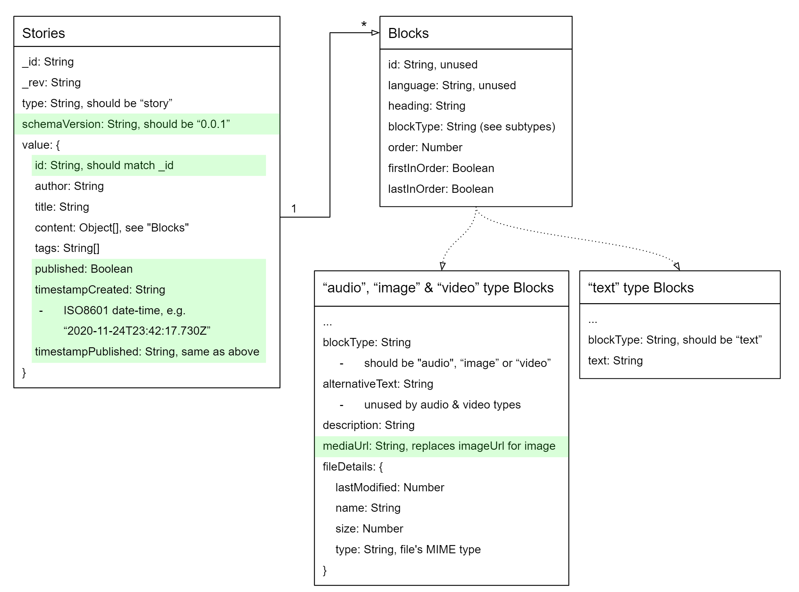
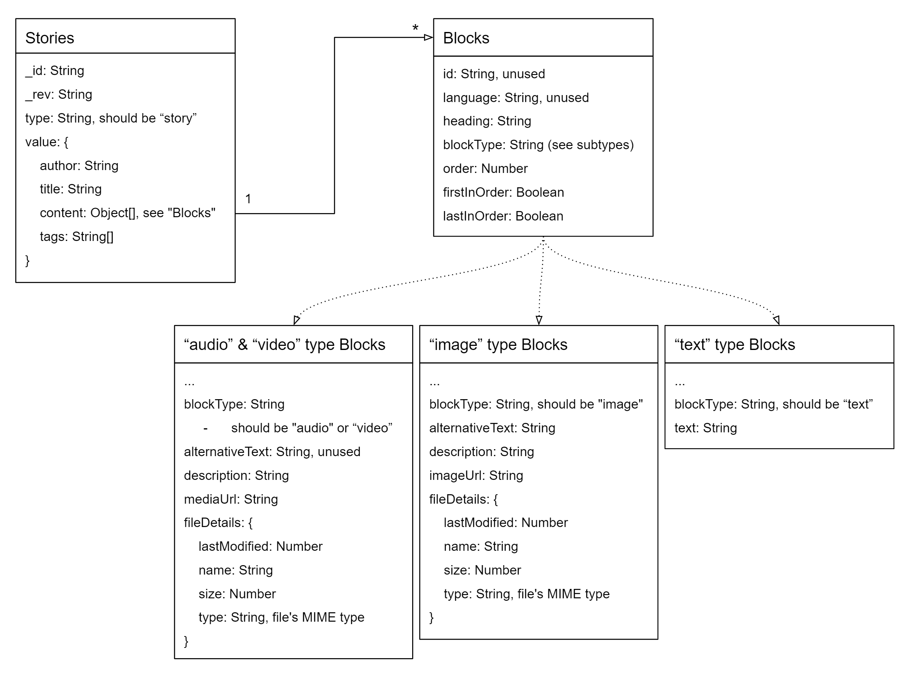

# Data Migration

## What is it?

Periodically, the model values for stories and blocks will change which necessitates database updates. These updates
are to be run manually and once per database in order to bring the existing data into compliance with the new data
schema. This document describes the data model used by the Storytelling Tool at various versions, and highlights the
differences from one version to the next.

The source files and instructions for each migration are located in migration-specific directories under
[`src\server\db\migrations`](../src/server/db/migrations) and are listed by date & the schema version they migrate
to and from.

E.g., the script to migrate from the `undefined` schema to schema version `0.0.1` is located here:
[`src\server\db\migrations\2020-11-13_undefined_to_0.0.1\migrate_undefined_to_0.0.1.js`](../src/server/db/migrations/2020-11-13_undefined_to_0.0.1/migrate_undefined_to_0.0.1.js)

All schema documentation is presented in the format of and attempts to conform to some degree with [JSON Schema](https://json-schema.org/).
Each different block type has different data to store. All block types have their common keys documented under
`Blocks`, and the individual types are shown as `Blocks (text)` and so on, with the assumption that they include all
of the common keys.

---

## The current data schema: `0.0.1`

Schema version `0.0.1` is the first documented schema, as well as the first to be formally migrated. The use of this
schema coincides with the release of Storytelling Tool Version `0.4.0` which introduces server-side autosave, among
other features and fixes.

### Changes from `undefined` to `0.0.1`

Story records have had the following new keys added:

- `schemaVersion`: String, should be `"0.0.1"`
- `value.id`: String, this is meant to match the contents of `_id`, used for autosave
- `value.published`: Boolean, `true` if the story is published and `false` otherwise
- `value.timestampCreated`: String, should be an [ISO8601](https://en.wikipedia.org/wiki/ISO_8601) date-time in UTC,
e.g. `"2020-11-24T23:42:17.730Z"`
- `value.timestampPublished`: String, same format as `timestampCreated`
}`

For blocks within the `content` array of a Story, the only change is that `imageUrl` has been changed to `mediaUrl`
for `image`-type blocks, which means that other than the value of the `blockType` key, the three media block types
(`audio`, `image` and `video`) now have identical schemas:



### Schema detail

<!-- eslint-skip -->
```JavaScript
Stories: {
    "_id": { "type": "string" },
    "_rev": { "type": "string" },
    "type": { "type": "string" }, // should be "story" for all story records
    "value": {
        "id": { "type": "string" }, // should match the value at "story._id"
        "title": { "type": "string" },
        "author": { "type": "string" },
        "content": {
            "type": "array",
            "items": {
                "type": "object" // see Blocks schema definitions below
            }
        },
        "tags": {
            "type": "array",
            "items": {
                "type": "number"
            }
        },
        "published": { "type": "boolean" },
        "timestampCreated": {
            "type": "string",
            "format": "date-time" // ISO8601 date-time, e.g. "2020-11-24T23:42:17.730Z"
        },
        "timestampPublished": {
            "type": "string",
            "format": "date-time" // same as timestampCreated
        }
    },
    "schemaVersion": { "const": "0.0.1" }
}
```

<!-- eslint-skip -->
```JavaScript
Blocks: {
    "id": { "type": "string" }, // unused
    "blockType": { "type": "string" },
    "language": { "type": "string" }, // referred to but not written to
    "heading": { "type": "string" },
    "order": { "type": "number" },
    "firstInOrder": { "type": "boolean" },
    "lastInOrder": { "type": "boolean" },
}
```

<!-- eslint-skip -->
```JavaScript
Blocks (text): {
    "blockType": { "const": "text" }, // the value is "text" for text blocks
    "text": { "type": "string" }
}
```

<!-- eslint-skip -->
```JavaScript
Blocks (audio, image or video): {
    // blockType should match the type of block:
    // - "audio" for audio blocks
    // - "image" for image blocks
    // - "video" for video blocks
    "blockType": { "type": "string" },
    "alternativeText": { "type": "string" }, // unused by audio & video blocks
    "description": { "type": "string" },
    "mediaUrl": { "type": "string" },
    "fileDetails": {
        "type": "object",
        "properties": {
            "lastModified": { "type": "number" },
            "name": { "type": "string" },
            "size": { "type": "number" },
            "type": { "type": "string" } // represents MIME type of the file
        }
    }
}
```

---

## Previous schema versions

### `undefined` / pre-`0.0.1`

#### Before history began...

This version represents the data before we began to track schema versions and validate the data. There are quite a
few fields which were added, used, removed, or unused, and which were since removed before `0.0.1`.



#### Schema detail

<!-- eslint-skip -->
```JavaScript
Stories: {
    "_id": { "type": "string" },
    "_rev": { "type": "string" },
    "type": { "type": "string" }, // should be "story" for all story records
    "value": {
        "author": { "type": "string" },
        "title": { "type": "string" },
        "content": {
            "type": "array",
            "items": {
                "type": "object" // see block schema definitions below
            }
        },
        "tags": {
            "type": "array",
            "items": {
                "type": "number"
            }
        }
    }
}
```

<!-- eslint-skip -->
```JavaScript
Blocks: {
    "id": { "type": "string" }, // unused
    "blockType": { "type": "string" },
    "language": { "type": "string" }, // referred to but not written to
    "heading": { "type": "string" },
    "order": { "type": "number" },
    "firstInOrder": { "type": "boolean" },
    "lastInOrder": { "type": "boolean" },
}
```

<!-- eslint-skip -->
```JavaScript
Blocks (text): {
    "blockType": { "const": "text" }, // the value is "text" for text blocks
    "text": { "type": "string" }
}
```

<!-- eslint-skip -->
```JavaScript
Blocks (audio or video): {
    // blockType should match the type of block:
    // - "audio" for audio blocks
    // - "video" for video blocks
    "blockType": { "type": "string" },
    "alternativeText": { "type": "string" }, // unused
    "description": { "type": "string" },
    "mediaUrl": { "type": "string" },
    "fileDetails": {
        "type": "object",
        "properties": {
            "lastModified": { "type": "number" },
            "name": { "type": "string" },
            "size": { "type": "number" },
            "type": { "type": "string" } // represents MIME type of the file
        }
    }
}
```

<!-- eslint-skip -->
```JavaScript
Blocks (image): {
    "blockType": { "const": "image" }, // the value is "image" for image blocks
    "alternativeText": { "type": "string" },
    "description": { "type": "string" },
    "imageUrl": { "type": "string" },
    "fileDetails": {
        "type": "object",
        "properties": {
            "lastModified": { "type": "number" },
            "name": { "type": "string" },
            "size": { "type": "number" },
            "type": { "type": "string" } // represents MIME type of the file
        }
    }
}
```
